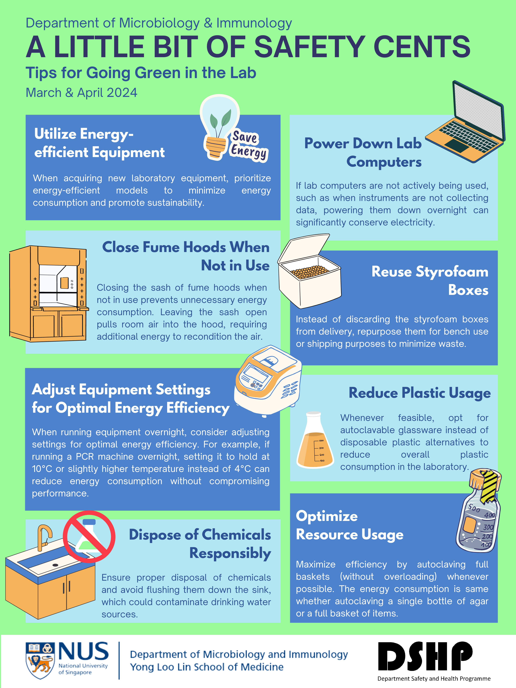

## Background
In my role as a Safety Committee member at the Department of Microbiology and Immunology, Yong Loo Lin School of Medicine, I collaborate closely with the Department Safety Coordinator to promote and uphold a strong safety culture within the department. 
One of my key responsibilities involves creating and designing bi-monthly infographic posters that offer essential safety tips for working in the laboratory. 
These visual aids are designed to provide quick and effective guidance to students and staff, ensuring a safer working environment for all.
This repository is designed to keep all the infographic posters I have created and to summarize them on HTML pages.

## Latest Design

